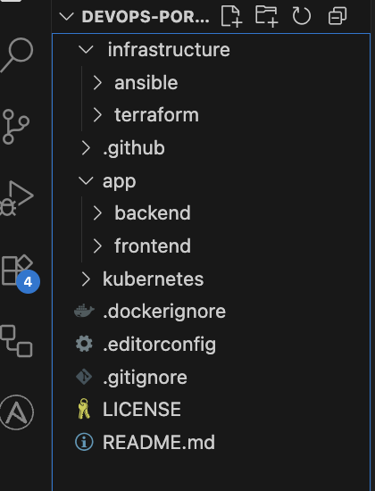
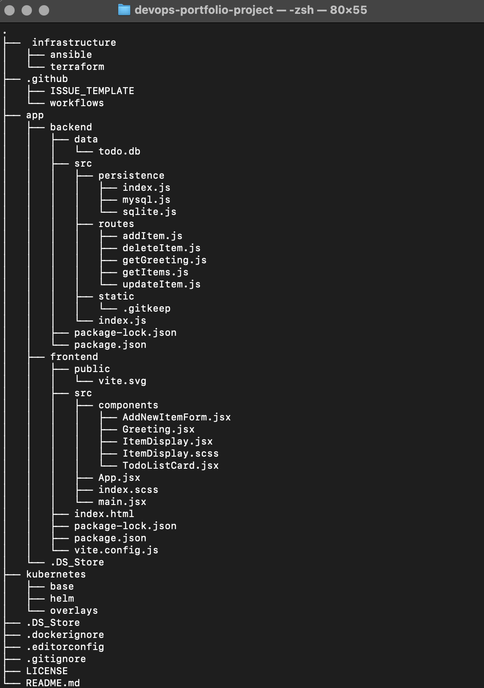
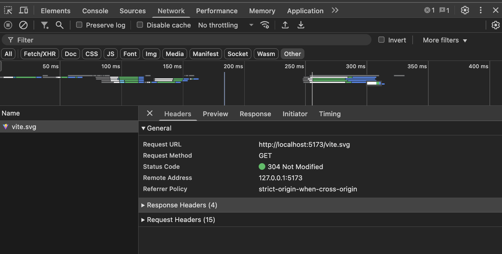

# GitOps & DevOps: From Code to Kubernetes on macOS


**Complete implementation of a DevOps pipeline for a web application using modern practices: CI/CD, Infrastructure as Code, Kubernetes, and GitOps, tailored for a local development environment.**

## 📖 Project overview

This project demonstrates the full deployment cycle of a cloud-native application (Todo App) using a modern DevOps stack. The goal is to create a reliable, automated, and secure pipeline from code to production without relying on paid cloud services. This setup is perfect for local development and portfolio demonstration on a macOS environment.

**👨‍💻 Author:** Pavlo \
**📧 Contacts:** [paul.antonenko.w@gmail.com](paul.antonenko.w@gmail.com) | [LinkedIn](https://www.linkedin.com/in/pavlo-antonenko/) \
**🚀 Live Demo:** _Add link after deployment_

---

## 🏗 System architecture

_The architecture is designed to be self-contained and free, leveraging local virtualization and containerization tools on macOS._

### Planned components:
1. **Source code:** GitHub repository with branching using the GitFlow strategy
2. **CI/CD:** GitHub Actions for building, testing, and scanning images
3. **Image registry:** DockerHub
4. **Local Infrastructure:** A Linux VM on UTM (for local testing of infrastructure automation with Ansible) and Docker Desktop for Mac (for local Kubernetes)
5. **Infrastructure as Code (IaC):** Ansible to automate the provisioning of the local VM
5. **Containerization:** Docker
6. **Orchestration:** Kubernetes (using the built-in feature of Docker Desktop for Mac)
6. **GitOps:** ArgoCD for automated deployments to Kubernetes
7. **Monitoring:** Prometheus/Grafana for metrics collection and visualization

---

## ⚙️ Technology stack

| Category | Technologies |
|-----------|------------|
| **Local Environment** | macOS, UTM |
| **Infrastructure as Code** | Ansible |
| **CI/CD** | GitHub Actions |
| **Containers** | Docker |
| **Orchestration & GitOps** | Kubernetes (Docker Desktop), Helm, ArgoCD |
| **Web Servers** | Nginx |
| **Programming** | Node.js, React |
| **Version Control** | Git, GitHub |

---

## 📂 Repository structure (current state)

<pre>
devops-portfolio-project/
├──  infrastructure
│   ├── ansible
│   └── terraform
├── .github
│   ├── ISSUE_TEMPLATE
│   └── workflows
├── app
│   ├── backend
│   │   ├── data
│   │   │   └── todo.db
│   │   ├── src
│   │   │   ├── persistence
│   │   │   │   ├── index.js
│   │   │   │   ├── mysql.js
│   │   │   │   └── sqlite.js
│   │   │   ├── routes
│   │   │   │   ├── addItem.js
│   │   │   │   ├── deleteItem.js
│   │   │   │   ├── getGreeting.js
│   │   │   │   ├── getItems.js
│   │   │   │   └── updateItem.js
│   │   │   ├── static
│   │   │   │   └── .gitkeep
│   │   │   └── index.js
│   │   ├── package-lock.json
│   │   └── package.json
│   ├── frontend
│   │   ├── public
│   │   │   └── vite.svg
│   │   ├── src
│   │   │   ├── components
│   │   │   │   ├── AddNewItemForm.jsx
│   │   │   │   ├── Greeting.jsx
│   │   │   │   ├── ItemDisplay.jsx
│   │   │   │   ├── ItemDisplay.scss
│   │   │   │   └── TodoListCard.jsx
│   │   │   ├── App.jsx
│   │   │   ├── index.scss
│   │   │   └── main.jsx
│   │   ├── index.html
│   │   ├── package-lock.json
│   │   ├── package.json
│   │   └── vite.config.js
├── kubernetes
│   ├── base
│   ├── helm
│   └── overlays
├── .dockerignore
├── .editorconfig
├── .gitignore
├── LICENSE
└── README.md
</pre>

---

## 🚀 Current status

### ✅ Stage 0: Preparation (Completed)
- [x] A public GitHub repository has been created
- [x] Folder structure initialized
- [x] Added the base code of the application (backend on Node.js and frontend on React)
- [x] `master` branch configured

### 🔄 Next steps:
- [ ] Stage 1: Manual VM setup and initial deployment.
- [ ] Stage 2: Set up CI/CD with GitHub Actions.
- [ ] Stage 3: Automate infrastructure provisioning with Ansible.
- [ ] Stage 4: Deploy to Kubernetes using GitOps.
- [ ] Stage 5: Monitoring and logging.

---

## 🚀 How to run a project locally

The instructions below will allow you to run a copy of the project on your local computer for development and testing.

### Prerequisites:

Before you start, make sure that your computer has:
*   **Node.js** (version 16 or higher) - runtime environment for JavaScript.
*   **npm** - package manager, installed with Node.js.
*   **Git** - to clone the repository.

**How to check?** Run in terminal:
```bash
   node --version
   npm --version
   git --version
```
### Steps to start:
<details>
<summary>Clone the repository:</summary>
  
```bash
   git clone https://github.com/cicero-w/devops-portfolio-project.git
   cd your-repository
```
</details>
<details>
<summary>Start the backend (API server)</summary>

+ Open a terminal and go to the backend folder:

```bash
   cd app/backend
```
+ Install dependencies:

```bash
  npm install
```
+ Start the server:

```bash
  npm run dev
```
+ The server will start on port `3000`: `http://localhost:3000`
</details>
<details>
<summary>Launch the frontend (client side):</summary>

+ Open a new terminal (so as not to stop the backend) and go to the frontend folder:

```bash
  cd app/frontend
```
+ Install dependencies:

```bash
  npm install
```
+ Launch the client:

```bash
  npm run dev
```
+ The application will automatically open in the browser on the port `5173`: `http://localhost:5173`
</details>

---

## 📊 System operation screenshots

<details>
<summary>Stage 0</summary>

<details>
<summary>Project structure in IDE</summary>


</details>

<details>
<summary>Command line with structure</summary>
   

</details>

<details>
<summary>A working application in the browser</summary>
   

</details>

<details>
<summary>Frontend-backend interaction</summary>
   

</details>
</details>

---

## 🛣 Roadmap

The following stages outline the path from a basic application to a fully automated DevOps pipeline.

* Stage 0: Preparation
  + Create a public GitHub repository
  + Initialize the folder structure
  + Push the application's base code

* Stage 1: Manual Deployment on a Local VM
  + Set up a Linux VM using UTM on macOS
  + Manually configure the VM (install Docker, Git)
  + Clone the repository and run the application using `docker-compose`

* Stage 2: Build and Security Automation (CI)
  + Set up DockerHub repositories
  + Configure GitHub Secrets for DockerHub credentials
  + Create a GitHub Actions workflow to lint, build, scan (with Trivy), and push Docker images to DockerHub
 
* Stage 3: Infrastructure as Code (Ansible) and Deployment Automation (CD)
  + Write Ansible playbooks to automate the VM setup from Stage 1
  + Automate the deployment process on the VM using `docker-compose pull` and `up`
  + Integrate this into the CI/CD pipeline
 
* Stage 4: Kubernetes and GitOps
  + Enable Kubernetes in Docker Desktop
  + Create Helm charts for the application
  + Set up ArgoCD to manage deployments from Git
  + Implement GitOps principles

* Stage 5: Monitoring and Logging
  + Deploy Prometheus/Grafana to the Kubernetes cluster.
  + Configure dashboards to monitor application metrics.

---

## 📄 License
This project is licensed under the MIT License. See the [LICENSE](LICENSE) file for details.

## 🤝 Contribution
Contributions are welcome! Please feel free to create issues or pull requests for any improvements.

## ⭐️ If you liked this project, please star it on GitHub!
