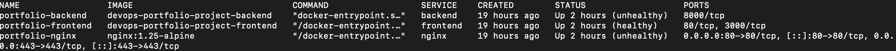

# GitOps & DevOps: From Code to Kubernetes on macOS

<!--  -->

**Complete implementation of a DevOps pipeline for a web application using modern practices: CI/CD, Infrastructure as Code, Kubernetes, and GitOps, tailored for a local development environment.**

## Project overview

This project demonstrates the full deployment cycle of a cloud-native application (Todo App) using a modern DevOps stack. The goal is to create a reliable, automated, and secure pipeline from code to production without relying on paid cloud services. This setup is perfect for local development and portfolio demonstration on a macOS environment.

**Author:** Pavlo \
**Contacts:** [paul.antonenko.w@gmail.com](paul.antonenko.w@gmail.com) | [LinkedIn](https://www.linkedin.com/in/pavlo-antonenko/) \
**Live Demo:** http://your-ip(or your-vm-ip)
---

## System Architecture

_The architecture is designed to be self-contained and free, leveraging local virtualization and containerization tools on macOS._

### Components:
1. **Source code:** GitHub repository with branching using the GitFlow strategy
2. **CI/CD:** GitHub Actions for building, testing, and scanning images
3. **Image registry:** DockerHub
4. **Local Infrastructure:** Linux VM on UTM + Docker Desktop for Mac
5. **Infrastructure as Code:** Ansible for VM provisioning automation
5. **Containerization:** Docker with multi-stage builds
6. **Orchestration:** Kubernetes (Docker Desktop built-in)
6. **GitOps:** ArgoCD for automated deployments
7. **Monitoring:** Prometheus/Grafana stack

---

## Technology Stack

| Category | Technologies |
|-----------|------------|
| **Local Environment** | macOS, UTM (Ubuntu Server VM) |
| **Infrastructure as Code** | Ansible |
| **CI/CD** | GitHub Actions |
| **Containers** | Docker, Docker Compose |
| **Orchestration & GitOps** | Kubernetes (Docker Desktop), Helm, ArgoCD |
| **Web Servers** | Nginx (Reverse Proxy) |
| **Programming** | Node.js (Express), React (Vite) |
| **Database** | SQLite |
| **Version Control** | Git, GitHub |

---

## Repository Structure

<pre>
devops-portfolio-project/
├── infrastructure/
│   ├── ansible/
│   └── terraform/
├── .github/
│   ├── ISSUE_TEMPLATE/
│   └── workflows/
├── app/
│   ├── backend/                    # Node.js API server
│   │   ├── src/
│   │   │   ├── persistence/        # Database layer
│   │   │   ├── routes/             # API endpoints
│   │   │   └── index.js            # Main server file
│   │   ├── Dockerfile
│   │   ├── healthcheck.js
│   │   ├── package.json
│   │   └── package-lock.json
│   └── frontend/                   # React client
│       ├── src/
│       │   ├── components/
│       │   ├── App.jsx
│       │   └── main.jsx
│       ├── Dockerfile
│       ├── package.json
│       ├── package-lock.json
│       └── vite.config.js
├── nginx/                          # Reverse proxy configuration
│   ├── nginx.conf
│   └── default.conf
├── kubernetes/
│   ├── base/
│   ├── helm/
│   └── overlays/
├── docker-compose.yml              # Multi-container orchestration
├── .dockerignore
├── .gitignore
├── LICENSE
└── README.md
</pre>

---

## Current Status

### Stage 0: Preparation ✅ (Completed)
- [x] Created public GitHub repository
- [x] Initialized folder structure
- [x] Added base application code (Node.js backend + React frontend)
- [x] Configured `master` branch

### Stage 1: Manual VM Setup and Docker Deployment ✅ (Completed)
- [x] VM Configuration: Set up Ubuntu Server VM in UTM with bridged networking
- [x] SSH Access: Configured passwordless SSH connection from macOS to VM
- [x] Docker Installation: Installed Docker and Docker Compose on VM
- [x] Application Containerization:
      - Created multi-stage Dockerfile for React frontend with Nginx
      - Optimized Node.js backend Dockerfile with security best practices
      - Implemented health checks for all services
- [x] Reverse Proxy Setup: Configured Nginx with:
      - Load balancing upstream configuration
      - Security headers and rate limiting
      - JSON logging for monitoring integration
      - Gzip compression optimization
- [x] Multi-Container Architecture: Docker Compose setup with:
      - Isolated network with static IP assignment
      - Resource limits and reservations
      - Service dependencies and health checks
      - Volume management for persistent logs
- [x] Production Deployment: Successfully deployed full-stack application accessible via `http://vm-ip`

Key Achievements:
  - Zero-downtime architecture with health checks and graceful shutdowns
  - Security hardening with non-root users, minimal attack surface
  - Performance optimization with caching, compression, and resource limits
  - Monitoring readiness with structured logging and health endpoints

### Next Steps:
- [ ] Stage 2: Set up CI/CD with GitHub Actions.
- [ ] Stage 3: Infrastructure as Code with Ansible
- [ ] Stage 4: Kubernetes and GitOps with ArgoCD
- [ ] Stage 5: Monitoring and Observability

---

## How to Run Project Locally

The instructions below will allow you to run a copy of the project on your local computer for development and testing (Stage 0 setup).

### Prerequisites:

Before you start, make sure that your computer has:
*   **Node.js** (version 18 or higher) - runtime environment for JavaScript.
*   **npm** - package manager, installed with Node.js.
*   **Git** - to clone the repository.

**How to check?** Run in terminal:
```bash
   node --version
   npm --version
   git --version
```
### Steps to start:
<details>
<summary>1. Clone the repository:</summary>
  
```bash
   git clone https://github.com/cicero-w/devops-portfolio-project.git
   cd your-repository
```
</details>
<details>
<summary>2. Start the backend (API server)</summary>

```bash
    cd app/backend
    npm install
    npm run dev
    # Server will be available at http://localhost:3000
```
</details>
<details>
<summary>Launch the frontend (client side):</summary>

```bash
    cd app/frontend
    npm install
    npm run dev
    # Application will be available at http://localhost:5173
```
</details>

---

## System Operation Screenshots

<details>
<summary>Stage 0: Local Development</summary>


_Todo application running locally with Node.js backend and React frontend_

</details>
<details>
<summary>Stage 1: Production Deployment on VM</summary>


_Full-stack application deployed on Ubuntu VM with Docker containers_


_All services running with health checks in Docker Compose_

</details>

---

## Roadmap

The following stages outline the path from a basic application to a fully automated DevOps pipeline.

* Stage 0: Preparation ✅
  + Create a public GitHub repository
  + Initialize the folder structure
  + Push the application's base code

* Stage 1: Manual Deployment on Local VM ✅
  + Set up a Linux VM using UTM on macOS
  + Manually configure the VM (install Docker, Git)
  + Clone the repository and run the application using Docker Compose
  + Configure Nginx reverse proxy with security headers
  + Implement health checks and monitoring readiness

* Stage 2: Build and Security Automation (CI)
  + Set up DockerHub repositories
  + Configure GitHub Secrets for DockerHub credentials
  + Create a GitHub Actions workflow to lint, build, scan (with Trivy), and push Docker images to DockerHub
 
* Stage 3: Infrastructure as Code (Ansible) and Deployment Automation (CD)
  + Write Ansible playbooks to automate the VM setup from Stage 1
  + Automate the deployment process on the VM using docker compose
  + Integrate this into the CI/CD pipeline
 
* Stage 4: Kubernetes and GitOps
  + Enable Kubernetes in Docker Desktop
  + Create Helm charts for the application
  + Set up ArgoCD to manage deployments from Git
  + Implement GitOps principles

* Stage 5: Monitoring and Logging
  + Deploy Prometheus/Grafana to the Kubernetes cluster.
  + Configure dashboards to monitor application metrics.

---

## Production Deployment on VM

### Architecture Overview:

`Internet → VM (Ubuntu) → Nginx (Port 80) → Frontend (Port 3000) → Backend API (Port 8000)`

<details>
<summary>Deployment Process:</summary>
  
  - VM Setup: Ubuntu Server VM with 2+ CPU, 2-4GB RAM
  - Docker Installation: Latest Docker CE + Docker Compose
  - Application Build: Multi-stage Docker builds for optimized images
  - Service Orchestration: Docker Compose with health monitoring
  - Access: Application available at `http://vm-ip-address`
</details>
<details>
<summary>Key Features:</summary>
  
  - **High Availability:** Health checks with automatic container restart
  - **Security:** Non-root containers, security headers, rate limiting
  - **Performance:** Multi-stage builds, Nginx caching, resource limits
  - **Observability:** Structured JSON logging, health endpoints
  - **Scalability:** Load balancer configuration ready for horizontal scaling
</details>
<summary>Deployment Commands</summary>

  ## On VM (Ubuntu):

  ```bash
   # Update system and install Docker
  sudo apt update && sudo apt upgrade -y
  curl -fsSL https://get.docker.com -o get-docker.sh
  sudo sh get-docker.sh
  sudo usermod -aG docker $USER

  # Clone and deploy
  git clone https://github.com/cicero-w/devops-portfolio-project.git
  cd devops-portfolio-project
  docker compose up -d --build

  # Monitor deployment
  docker compose ps
  docker compose logs -f
  ```
</details>

---

## License
This project is licensed under the MIT License - see the [LICENSE](LICENSE) file for details.

## Contribution
Contributions are welcome! Please feel free to submit issues and pull requests